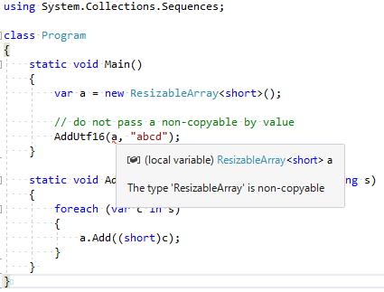
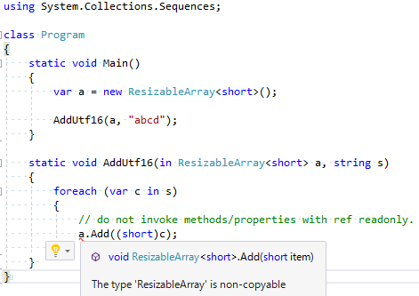

# NonCopyableAnalyzer

Some kind of structs should not be copied (especially mutable structs).
This package contains an analyzer for such a structs.

NuGet: [https://www.nuget.org/packages/NonCopyableAnalyzer/](https://www.nuget.org/packages/NonCopyableAnalyzer/)

## Example

A typical example of a non-copyable struct is [`ResizableArray`](https://github.com/dotnet/corefxlab/blob/master/src/System.Collections.Sequences/System/Collections/Sequences/ResizableArray.cs).
So I'll use it for explanation. Let's copy it from [corefxlab](https://github.com/dotnet/corefxlab/blob/master/src/System.Collections.Sequences/System/Collections/Sequences/ResizableArray.cs) and add an attribute named `NonCopyable`.

```cs
namespace System.Collections.Sequences
{
    // copy from corefxlab
    // a List<T> like type designed to be embeded in other types
    // this kind of type should not be copied
    [NonCopyable]
    public struct ResizableArray<T>
    {
        ...
    }
```

The analyzer checks the attribute only by name - any namespace, both internal and public are OK.

```cs
using System;

[AttributeUsage(AttributeTargets.Struct)]
internal class NonCopyableAttribute : Attribute { }
```

Now, the analyzer reports misuse of the non-copyable struct.

### Misuse 1: pass by value

```cs
using System.Collections.Sequences;

class Program
{
    static void Main()
    {
        var a = new ResizableArray<short>();

        // do not pass a non-copyable by value
        AddUtf16(a, "abcd");
    }

    static void AddUtf16(ResizableArray<short> a, string s)
    {
        foreach (var c in s)
        {
            a.Add((short)c);
        }
    }
}
```



### Misuse 2: read-only

```cs
using System.Collections.Sequences;

class Program
{
    static void Main()
    {
        var a = new ResizableArray<short>();

        AddUtf16(a, "abcd");
    }

    static void AddUtf16(in ResizableArray<short> a, string s)
    {
        foreach (var c in s)
        {
            // do not invoke methods/properties with ref readonly
            a.Add((short)c);
        }
    }
}
```


